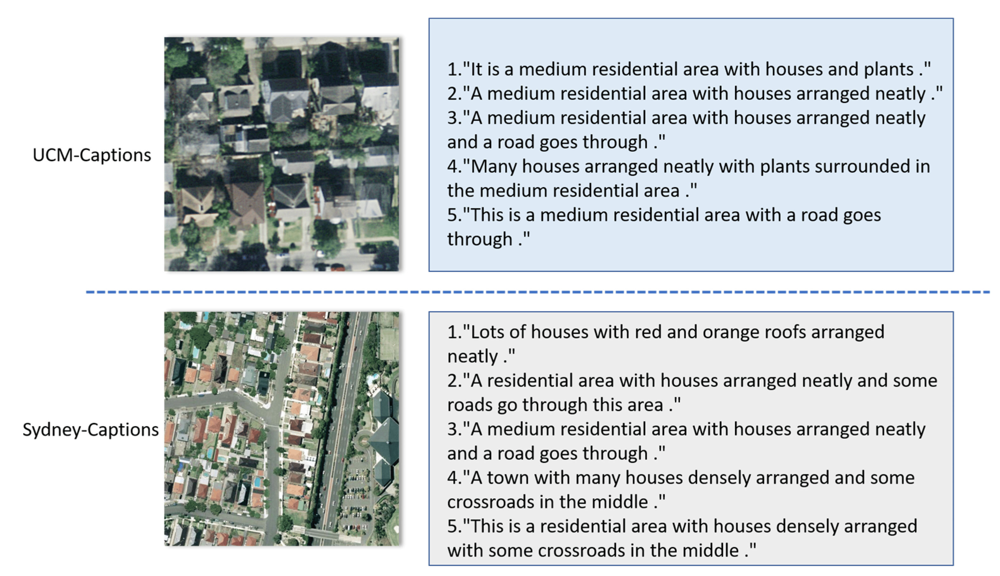

# UCM-MASK: UCM Caption Dataset with SAM Neural Network Masks

## Overview

This repository contains the results of generating masks from the UCM caption dataset. The original dataset is available for download from [Figshare](https://figshare.com/articles/dataset/UCM_image_dataset/6085976/2) and contains 2100 256×256 images of aerial views, each accompanied by five descriptive sentences. We processed this dataset using a SAM (Segment Anything Model) neural network to produce masks for each image.

<p float="center">
  
</p>

## Dataset Details

- **Original Dataset**: [UCM image dataset on Figshare](https://figshare.com/articles/dataset/UCM_image_dataset/6085976/2)
- **Image Count**: 2100
- **Image Resolution**: 256×256 pixels
- **Description**: Each image has five descriptive sentences.

## Processing Details

We utilized a SAM neural network with the following configurations:

- **Number of Image Proposals**: 50
- **Image Input Dimension**: 512
- **SAM Model Type**: Vit Big
- **Points per Image**: 50
- **Prediction IOU Threshold**: 0.5
- **Stability Score Threshold**: 0.8
- **Downscale Factor**: 2
- **Minimum Mask Region Area**: 5000

### Selective Search Hyperparameters

- **Scale**: 100
- **Sigma**: 1.5
- **Minimum Size**: 250

## Usage

The dataset generated in this repository is utilized in our conference paper titled "High-Resolution Remote Sensing Image Captioning Based on Structured Attention and SAM Network". Below is the abstract of the paper:

### Abstract

Due to its broad applications, remote sensing image captioning (RSIC) has gained popularity in recent years. However, it poses extra challenges for containing low-resolution images with highly structured semantic content. By incorporating image labeling and segmentation, this work develops an RSIC framework using a structured attention module that highlights important semantic components to maintain a geometric and structured shape. The quality and edge emphasis of UCM-captioned photographs are improved by upsampling them to 512×512 pixels. Using the Segment Anything Model (SAM) produces better image proposals, leading to higher accuracy than traditional techniques. A balanced output of large- and small-object masks is facilitated by SAM's promptability. The decoder can more easily learn a suitable statistical model using the model's spatial structure to provide an all-encompassing attention map. This work investigates the effects of multiple hyperparameters, including teacher forcing, the number of region proposals, and the impact of DSR and AVR loss factors. Overall, by combining image labeling and segmentation, this research improves remote sensing capabilities. It also shows how well the structured attention module and SAM work together to improve accuracy and consider different hyperparameter issues.

### Authors

- Yassin Riyazi
- Seyyed Mostafa Sadjadi
- Abbas Zohrevand
- Reshad Hosseini

## Repository Structure

- **/data**: Contains the processed images and corresponding masks.
- **/scripts**: Includes the code for processing the dataset with SAM and selective search.
- **/models**: Pre-trained SAM model files and configurations.
- **/results**: Outputs and evaluation metrics from our experiments.

## Citation

If you use this dataset or find it helpful in your research, please cite our conference paper:

```bibtex
@inproceedings{riyazi2024highresolution,
  title={High-Resolution Remote Sensing Image Captioning Based on Structured Attention and SAM Network},
  author={Yassin Riyazi, Seyyed Mostafa Sadjadi, Abbas Zohrevand, Reshad Hosseini},
  year={2024}
}
```

## License

This project is licensed under the MIT License - see the [LICENSE](LICENSE) file for details.

## Acknowledgments

We acknowledge the creators of the UCM caption dataset and the developers of the SAM neural network for their contributions, which made this work possible.

## Contact

For any questions or further information, please contact:

- **Yassin Riyazi**: iyasiniyasin98@gmail.com

---

Thank you for using our dataset! We hope it serves as a valuable resource for your research in remote sensing image captioning.
